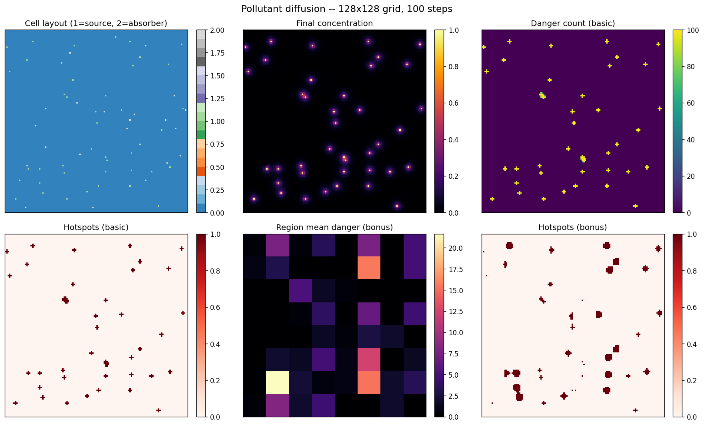

# GPU Pollutant Diffusion & Hotspot Detector

A GPU-accelerated simulation of how a pollutant spreads across a 2-D grid, and
which areas become persistent danger **hotspots**. The entire pipeline —
diffusion, sources/absorbers, danger counting, and per-region statistics — runs
on the GPU through a set of hand-written **CUDA kernels**, driven from Python via
[PyCUDA](https://documen.tician.de/pycuda/).



> The image above is produced directly by `main.py`: a 128×128 grid evolved over
> 100 time steps, showing the cell layout, the final concentration field, how
> long each cell stayed dangerous, and the detected hotspots for both analysis
> stages.

---

## What it models

The grid is seeded with two kinds of special cells:

- **Sources** continuously emit pollutant (their concentration is pinned high).
- **Absorbers** continuously remove it.

On every time step the simulation:

1. **Diffuses** the field — each cell relaxes toward the average of itself and
   its four neighbours (a 5-point stencil), then loses a fraction (`decay`).
2. **Re-applies** sources and absorbers.
3. **Counts danger** — every cell at or above a danger threshold gets its danger
   counter incremented, so it accumulates *how many steps* it spent dangerous.

After the loop it computes, per region, the **mean** and **standard deviation**
of the danger counts and flags every cell that stands out within its own region
(`danger > mean + α · stddev`) as a **hotspot**.

### Two analysis stages

| Stage | Danger threshold | Hotspot sensitivity `α` |
|-------|------------------|--------------------------|
| **Basic** | one global value | one global value |
| **Bonus** | per-region *profile* | per-region *profile* |

In the bonus stage each region has a *type*, and each type carries its own
`(α, threshold)` pair stored in **CUDA constant memory** — so different parts of
the map react to pollution with different sensitivity.

---

## How it works (the GPU pipeline)

Each kernel lives in its own file under [`kernels/`](kernels/):

| Kernel | File | Role |
|--------|------|------|
| `diffusion_step_kernel` | `diffusion.cu` | One diffusion step (5-point stencil + decay) |
| `apply_sources_kernel` | `sources.cu` | Re-apply sources / absorbers |
| `count_danger_kernel` | `count.cu` | Per-cell danger counter (global threshold) |
| `count_ever_dangerous_kernel` | `ever_dangerous.cu` | Count cells ever dangerous (atomic) |
| `region_hotspot_stats_kernel` | `hotspot.cu` | Per-region mean/stddev + hotspots |
| `count_danger_kernel_bonus` | `count_bonus.cu` | Danger counter with per-region thresholds |
| `region_hotspot_stats_kernel_bonus` | `hotspot_bonus.cu` | Per-region stats with per-region `α` |
| `RegionProfile` / constant array | `region_profile.cuh`, `region_profile.cu` | Region profiles in constant memory |

### Implementation highlights

- **Shared-memory parallel reduction** — the hotspot kernels launch one thread
  block per region and reduce the danger counts to a mean and standard deviation
  entirely in shared memory (a classic tree reduction), reusing one scratch
  buffer for both passes.
- **Constant memory for region profiles** — read by every thread, never written;
  exactly the access pattern `__constant__` memory is optimised for.
- **Ping-pong buffers** — the diffusion read/write buffers are swapped each step
  instead of copying the result back, avoiding a device-to-device copy per step.
- **Atomic accumulation** — the "ever dangerous" count is a single global counter
  built with `atomicAdd`.

---

## Project structure

```
.
├── main.py                # Python driver: config, CLI, simulation loop, plotting
├── kernels/               # CUDA kernels (one concern per file)
│   ├── diffusion.cu
│   ├── sources.cu
│   ├── count.cu
│   ├── ever_dangerous.cu
│   ├── hotspot.cu
│   ├── count_bonus.cu
│   ├── hotspot_bonus.cu
│   ├── region_profile.cuh
│   └── region_profile.cu
├── assets/simulation.png  # Sample output (shown above)
└── requirements.txt
```

---

## Requirements

- An NVIDIA GPU with the **CUDA toolkit** installed (`nvcc` on your `PATH`).
- Python 3.10+
- `numpy`, `pycuda`, `matplotlib`

```bash
pip install -r requirements.txt
```

## Usage

Run with the defaults (128×128 grid, 100 steps) — writes `assets/simulation.png`:

```bash
python main.py
```

Everything is configurable from the command line:

```bash
# Bigger, longer-running simulation with more sources
python main.py --width 256 --height 256 --steps 200 --num-sources 80

# Smaller regions and a more sensitive hotspot test
python main.py --region-rows 8 --region-cols 8 --alpha 1.5

# Headless run without producing the plot
python main.py --no-plot
```

See all options with:

```bash
python main.py --help
```

### Example console output

```
Grid                : 128 x 128 cells, 100 steps
Regions             : 8 x 8 (16x16 each)
Cells ever dangerous: 210 / 16384
Hotspots (basic)    : 210
Hotspots (bonus)    : 440
GPU pipeline time   : ... ms
Visualization saved : assets/simulation.png
```

> **Constraints:** the grid size must be divisible by the region size, and
> `region_rows × region_cols` must be a power of two (required by the
> shared-memory reduction) and fit in a single block (≤ 32×32, ≤ 1024 threads).
> `main.py` validates these before launching.

---

## Author

**Miloš Veličković** — originally built as a parallel-algorithms course project,
in collaboration with **Boris Živanović**; refactored and documented here as a
standalone showcase.
